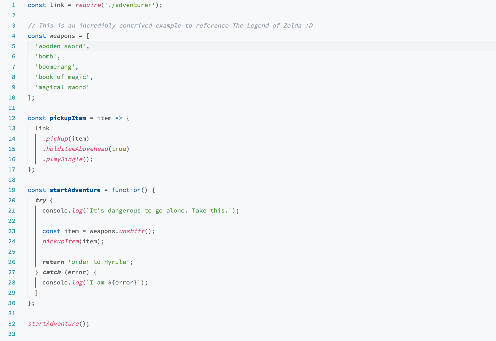
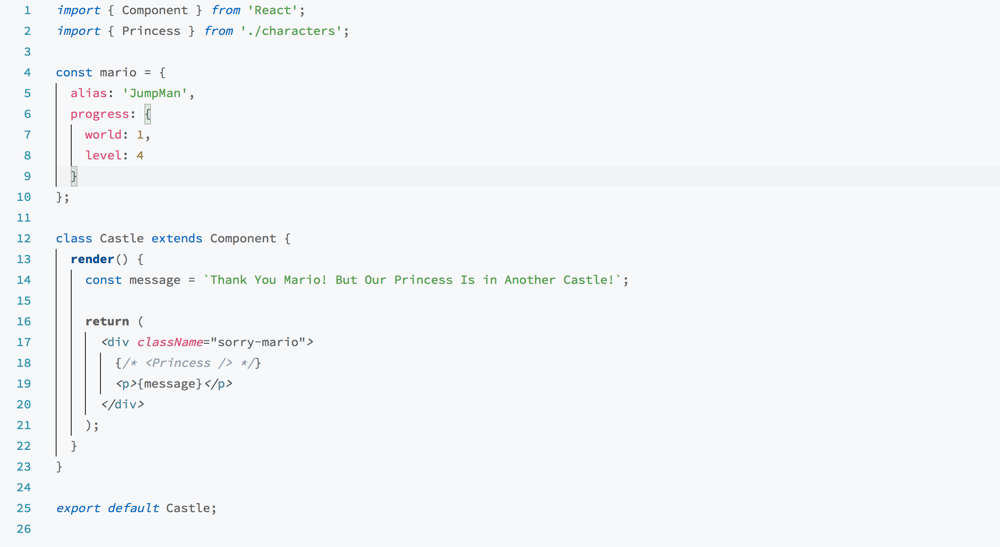
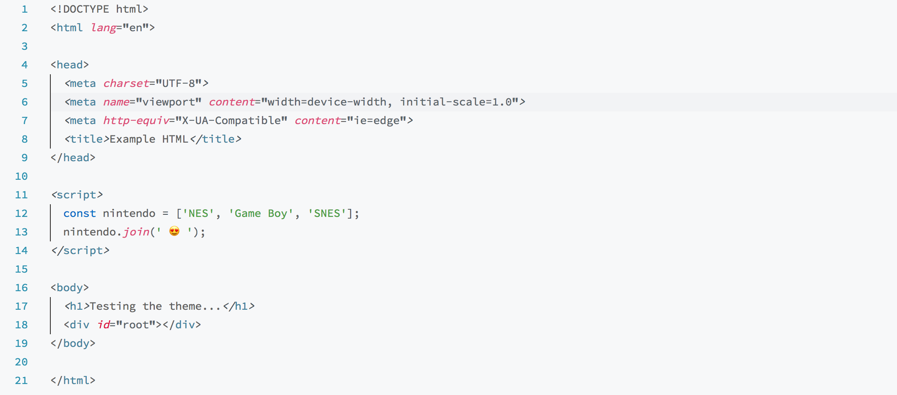
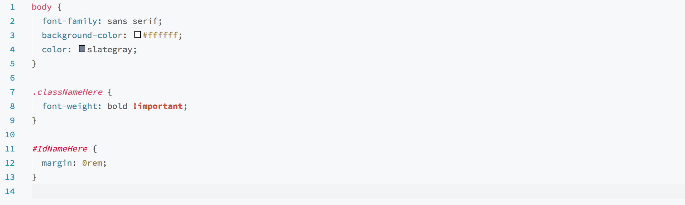

# Anchorage Theme for Visual Studio Code

Anchorage is a Light color theme for Visual Studio Code optimised for JavaScript development.

## Installation

In the command palette (`ctrl/cmd + shift + p`) type Install Extension and search for Anchorage.

## Screenshots

JavaScript

JSX

HTML

CSS

## Recommended Extras

I highly recommend installing the
[Latest TypeScript and Javascript Grammar](https://marketplace.visualstudio.com/items?itemName=ms-vscode.typescript-javascript-grammar) extension for much improved JavaScript (and TypeScript) syntax highlighting.

**Enjoy!**
